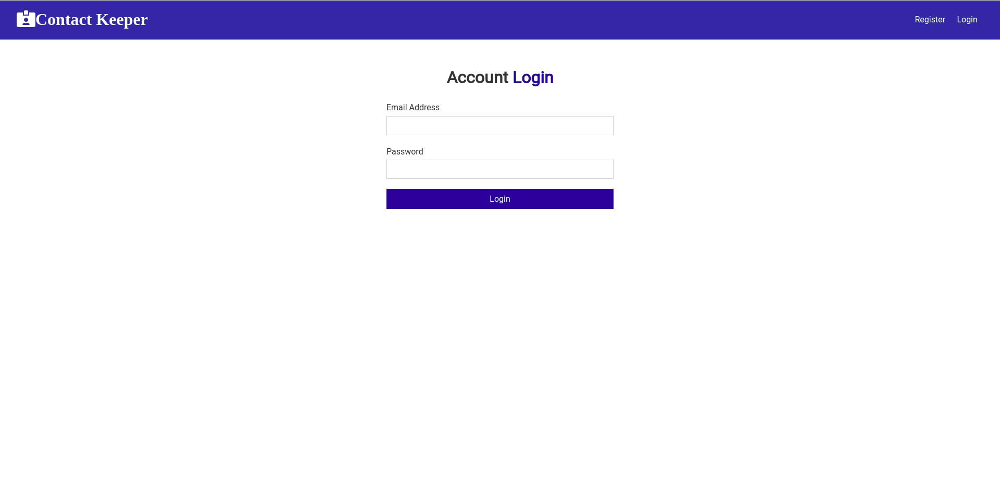
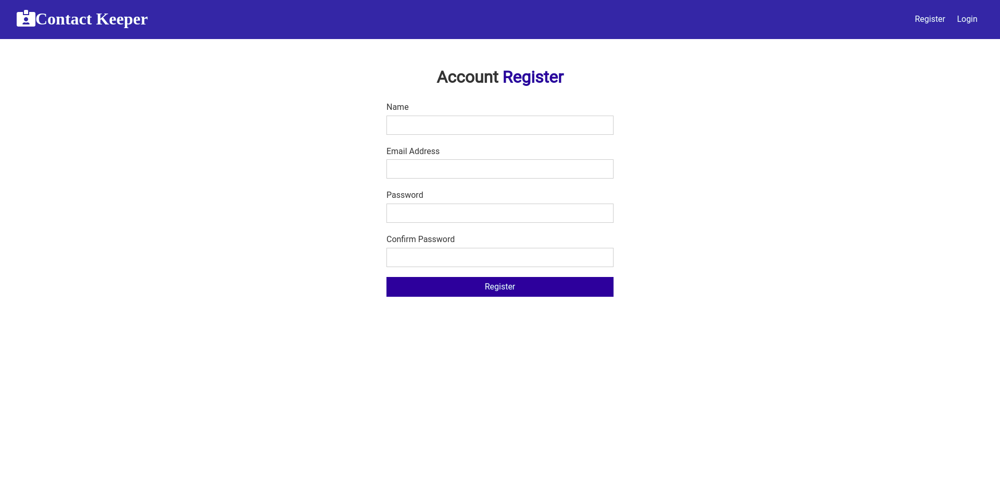
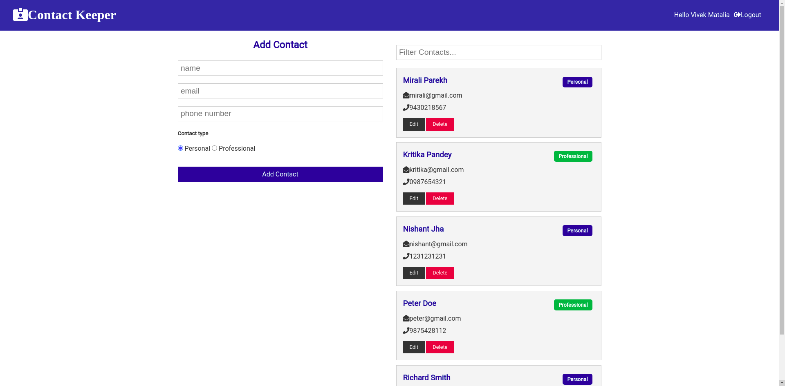
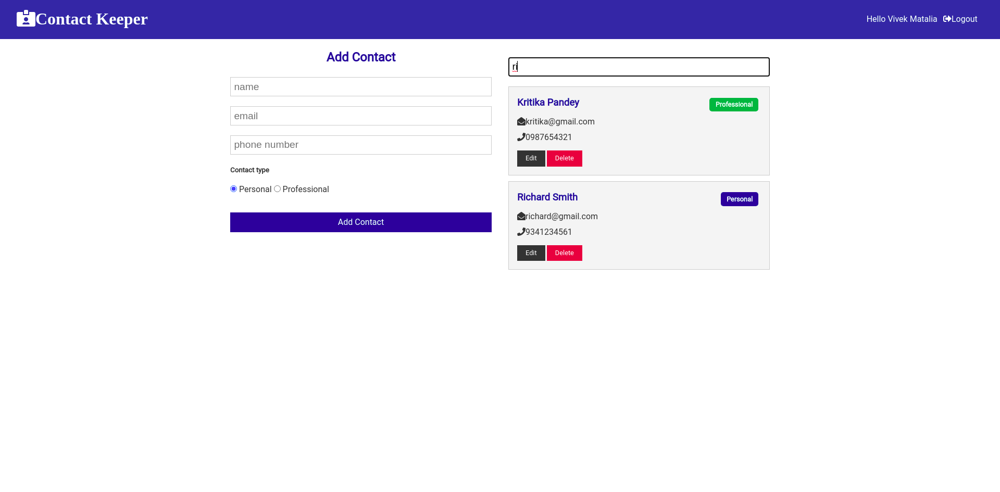

# Contact-Keeper

Contact keeper is where you can store you personal and professional contacts in an organized way.

https://contact-keeper-vivekapp.vercel.app/login

## Features

- Login and Sign Up into your account
- Add new contacts either personal or professional
- Edit and delete the contacts
- Get every single contact

## Future updates

- Better design
- Account recovery Features

## Build with

- [React.js](https://reactjs.org) : For the front-end
- [Express](https://expressjs.com/) : Backend framework
- [Node.js](https://nodejs.org/en/) : For backend
- [MongoDB](https://www.mongodb.com/) : For the database

## Screenshots

#### Login Page

#### Register Page

#### Home Page

#### Searhed Results

## To Run

- Clone into repo
- Run `npm install`
- Set the environment variables

| Parameter   |
| :---------- |
| `NODE_ENV`  |
| `jwtSecret` |
| `mongoURI`  |

- Run `cd client`
- Run `npm install`
- Run `cd ..`
- Run `npm run dev`

## Live Demo

https://contact-keeper-vivekapp.vercel.app/login
